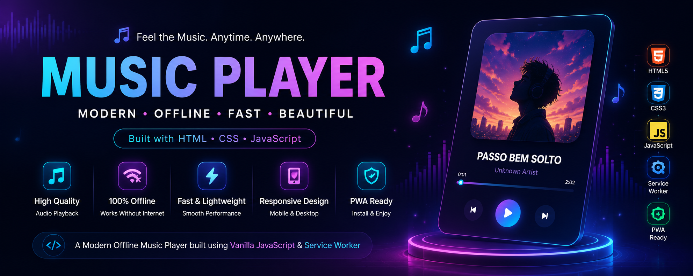

# 🎵 Music Player

A modern music player built using pure HTML, CSS and JavaScript.

The application provides a clean UI, playlist navigation, album artwork, playback controls, seek bar, offline support using Service Workers and responsive design.

Designed as a lightweight Progressive Web App (PWA) that can continue working even without an internet connection.

## 🚀 Live Demo

https://dhruvpandit46.github.io/Music-Player/

## ✨ Features

✅ Beautiful Glassmorphism UI

✅ Music Playback

✅ Previous / Next Controls

✅ Play / Pause

✅ Seek Bar

✅ Album Artwork

✅ Responsive Design

✅ Offline Support

✅ Service Worker

✅ Fast Loading

✅ Lightweight

